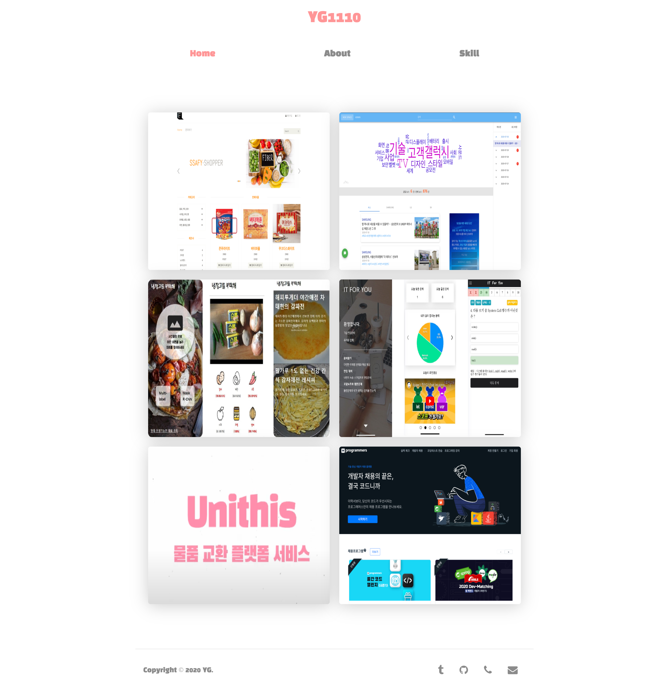

<h1 align="center">
	
     
     
    YG1110 Portfolio
</h1>

  

<h4 align="center">YG1110 Portfolio</h4>

**
[웹사이트](https://yg1110.github.io/Portfolio/) | [이슈 등록](https://github.com/yg1110/Portfolio/issues/new)
**

	

## 특징

- vanilla javascript만을 이용한 Portfoilo Page
- 커스텀 엘리먼트를 이용한 SPA 구현
- 진행했던 프로젝트 정보와 시연영상, 제가 구현한 부분, 기본이력서, 사용기술 정보가 존재합니다.
- 깃허브 페이지를 통해서 배포가 완료된 상태입니다.

## 기술스택
- [Javascript](https://developer.mozilla.org/ko/docs/Web/JavaScript)
- 기타 : [package.json](https://github.com/yg1110/Portfolio/blob/master/package.json) 참조

---

> [@yg1110](https://github.com/yg1110)